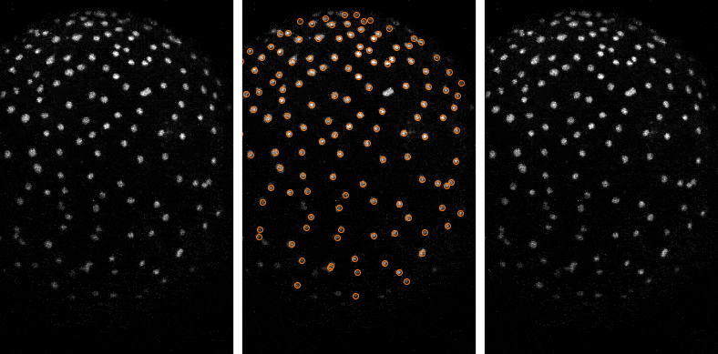

Example 2: Tracking objects
---------------------------

This example shows how to track previously-detected objects cross multiple frames.  

_**Key stages in detection and tracking of nuclei.** (Left) Raw images showing nuclei over time. (Middle) Centroids of detected nuclei highlighted with orange spots. (Right) Trajectories of tracked nuclei representwd by lines, colour-coded according to instantaneous velocity._

This example introduces the following concepts:
- Using the "Spot detection" module
- Using the "Track objects" module
- Making motion measurements for tracked objects
- Parent-child relationships in the context of tracked objects
- Filtering objects based on number of associated children
- Rendering tracks as overlays

Note: For this example, we're using a timelapse of yolk syncytial layer (YSL) nuclei from the [Cell Image Library](http://cellimagelibrary.org/images/11813) (doi: [10.7295/W9CIL11813](http://doi.org/10.7295/W9CIL11813)).  This timeseries was made available by Mark Cooper through Zebrafish - The Living Laboratory and is released under a [CC BY-NC-SA 3.0](https://creativecommons.org/licenses/by-nc-sa/3.0/) license.