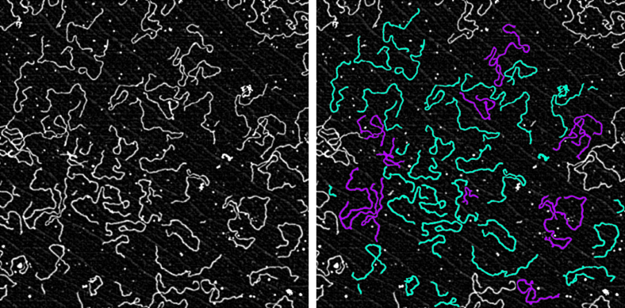

Example 3: Skeletonisation
---------------------------

This example shows how to use skeletonisation to measure the length of filamentous objects.   

_**Segmentation of DNA from Atomic Force Microscope (AFM) images.** (Left) Raw images showing linearised DNA depoaited onto mica surface. (Right) Detected DNA molecules colour-coded according to whether they are single molecules (cyan) or are  comprised of multiple overlapping molecules (magenta).. Molecules on the umage edge are automatically discarded._

This example introduces the following concepts:
- Using skeletonisation to measure the length of filamentous objexts
- Extended parent-child relationships (i.e. grandparent-grandchild)
- Partner-partner relationships
- Filtering objects based on their number of relationships with a specific class
- Moving filtered objects to a new object collection