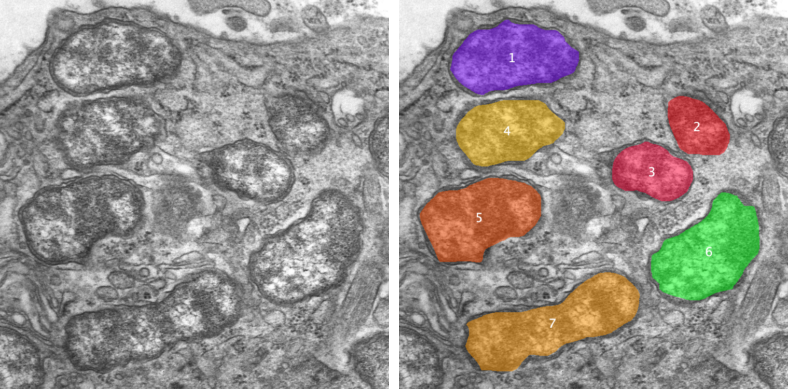

Example 4: Manual segmentation
---------------------------

This example demonstrates the "Manually Identify Objects" module as well as saving to and loading from file.

_**Manually annotated bacteria in TEM image.** (Left) Raw image showing mouse cell infected with bacteria [source](https://commons.wikimedia.org/wiki/File:Orientia_tsutsugamushi.JPG). (Right) Manually segmented bacteria assigned random colours and ID numbers._

This example introduces the following concepts:
- Using the "Manually Identify Objects" module to manually define objects within an image.
- Saving objects to zipped ImageJ ROI (region of interest) files
- Loading objects from zipped ImageJ ROI files